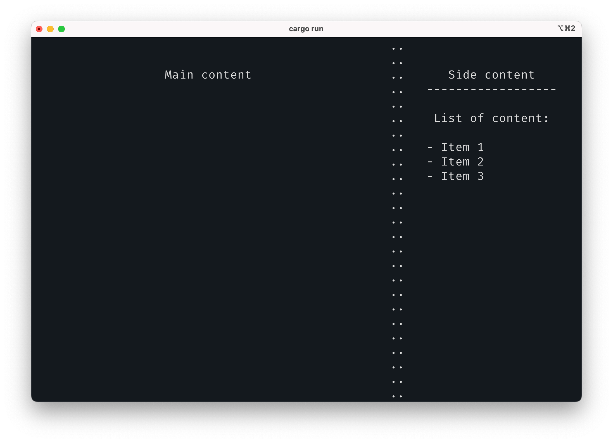
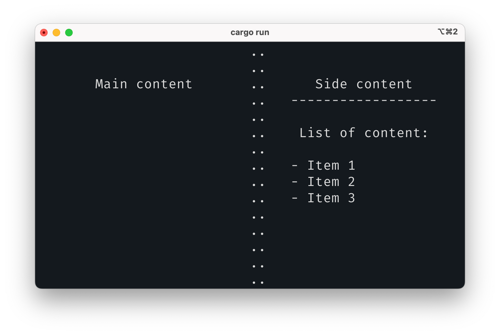

# Textyle

A layout engine inspired by SwiftUI and declarative UI frameworks. Originally focused on text and terminal graphics.

## Examples

I plan on making a DSL for it, but these examples use the rust `Enum` based API for now:

1- Sidebar layout

This code:

```rust
let layout = Layout::HorizontalStack( VerticalAlignment::Top, vec![
        Layout::text("Main content")
            .center_horizontally()
            .align_top()
            .padding_vertical(2)
            .border(2, '.', hash_set!(Edge::Right)),
        Layout::VerticalStack(HorizontalAlignment::Center, vec![
            Layout::text("Side content"),
            Layout::VerticalStack(HorizontalAlignment::Left, vec![
                Layout::text("List of content:")
                .padding(1),
                Layout::text("- Item 1"),
                Layout::text("- Item 2"),
                Layout::text("- Item 3"),
            ])
            .border(1, '-', hash_set![Edge::Top])
        ])
        .center_horizontally()
        .width(24)
        .padding_vertical(2)
    ]);
```

Produces the following UI:



If the canvas is given smaller dimensions, the declarative layout adapts:


